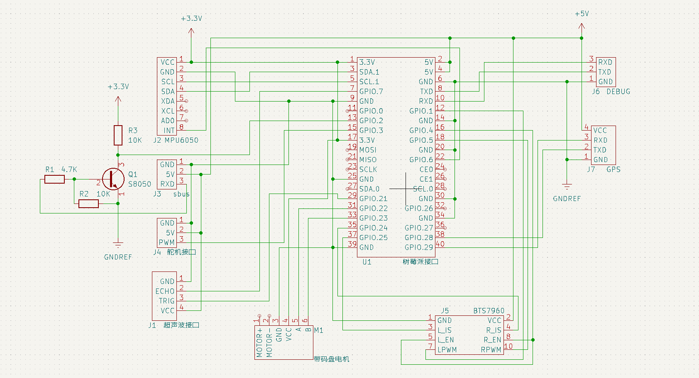

# linux 小车

## 电路图


### [f1c100s 遥控小车.](docs/F1c100s_Car.md)
### [OrangePi PC2 智能小车.](docs/OrangePi_Pc2.md)
### [MangoPi MQ PRO 智能小车.](docs/Mangopi_MQ_Pro.md)
### [MangoPi MQ QUAD 智能小车.](docs/Mangopi_MQ_Quad.md)

* 码农不易 尊重劳动
* 作者：大魔王与木头人
* 功能：基于Linux 的遥控智能小车(正在更新，敬请期待)
* QQ：846863428
* TEL: 15220187476
* email: 846863428@qq.com
* 修改时间 ：2023-01-10

If you find my work useful and you want to encourage the development of more free resources, you can do it by donating…

觉得不错给鼓励一下

**拿人家代码不star不fork的都是耍流氓**


## Development notes
1. 无线连接
```
wpa_passphrase OpenWrt_R619ac_2.4G 67123236 > /etc/wpa_supplicant.conf #生成配置文件
wpa_supplicant -B -i wlan0 -c /etc/wpa_supplicant.conf      #连接wifi
dhclient wlan0     #获取dhcp
```
2. tftp文件传输
```
tftp -g -r RemoteCar 192.168.3.161
```
## 视屏流避免频繁打印
修改

live/liveMedia/H264or5VideoStreamDiscreteFramer.cpp + 136

屏蔽打印
```
  // Begin by checking for a (likely) common error: NAL units that (erroneously) begin with a
  // 0x00000001 or 0x000001 'start code'.  (Those start codes should only be in byte-stream data;
  // *not* data that consists of discrete NAL units.)
  // Once again, to be clear: The NAL units that you feed to a "H264or5VideoStreamDiscreteFramer"
  // MUST NOT include start codes.
  if (frameSize >= 4 && fTo[0] == 0 && fTo[1] == 0 && ((fTo[2] == 0 && fTo[3] == 1) || fTo[2] == 1)) {
    // envir() << "H264or5VideoStreamDiscreteFramer error: MPEG 'start code' seen in the input\n";
  } else if (isVPS(nal_unit_type)) { // Video parameter set (VPS)
    saveCopyOfVPS(fTo, frameSize);
  } else if (isSPS(nal_unit_type)) { // Sequence parameter set (SPS)
    saveCopyOfSPS(fTo, frameSize);
  } else if (isPPS(nal_unit_type)) { // Picture parameter set (PPS)
    saveCopyOfPPS(fTo, frameSize);
  }
```
